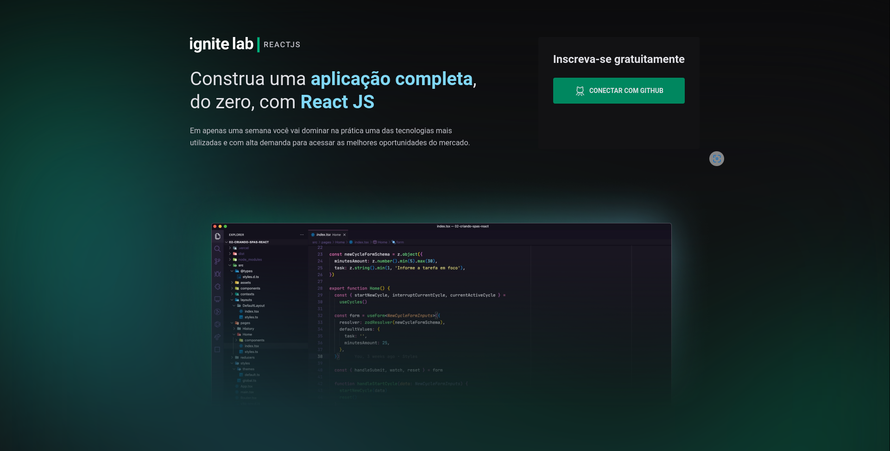

## ✨ Stack
-  [x] React
-  [x] Typescript
-  [x] Tailwind CSS
-  [x] Headless CMS (Content Management System) com graphcms (https://graphcms.com/)
-  [x] @apollo/client and Graphql
-  [x] svg2jsx para gerar um componente SVG (https://svg2jsx.com/)
-  [x] Phosphor icon family (https://phosphoricons.com/)
-  [x] Lib classnames
-  [x] graphql-code-generator (https://www.graphql-code-generator.com/docs/getting-startedinstallation)
-  [x] NextJs (https://nextjs.org/)
-  [x] NextAuth (Next-auth.js.org)

## 🔖 Layout

Você pode visualizar o layout do projeto através [desse link](https://www.figma.com/community/file/1120711251998877938). É necessário ter conta no [Figma](http://figma.com/) para acessá-lo.

## Executando o projeto

Pelo seu terminal navegue até a pasta do projeto e execute:

```cl
  yarn
  yarn dev
```
